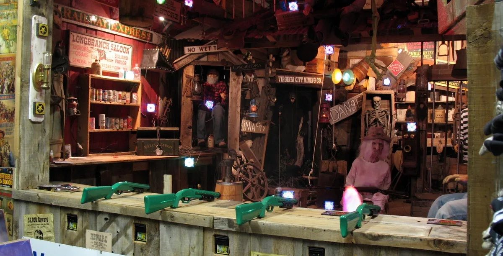

# Western Shooting Gallery

When you go to a fair or an amusement park, you often find Shooting Galleries.
We would like you to create the gameplay of a Shooting Gallery in about 2 days (maximum 16 hours)

## The Project

The last person that worked on this project was so kind to add most of the assets, some scripts and a scene to work in.
Unfortunately, this coder was very sloppy and it seems the project has some weird gameplay behaviors.

## Getting started

The project was last opened in Unity 2020.3.16f1.
If you are using a later version of Unity 2020.3, this is fine. You can upgrade the project to the latest LTS release.

Start by opening the scene `Assets/Scenes/Saloon.unity`

Press Play. You can now pick-up a weapon with E and start shooting with left mouse button.
Shooting should write to the log `SHOOT!`. Hitting something should write to the log `HIT`.
You can also see the ray of the shot (Debug.DrawRay) drawn in the scene view.

## Must Have

Don't worry if you can't finish all of the Must Have requirements.
Try your best and see how far you get. Quality > Quantity.
It's not because you don't finish the Must Have section that you failed.

### General rules

* Please stick to our coding standards: [Coding Standards](README-Data/CodingStandards.pdf)
* No compile errors
* No uncaught exceptions are thrown

### Menu

#### Main menu
We want a very basic UI with a Start Game button.

#### Game ended menu
Basic UI showing player score and a button to restart the game

#### In game UI
* Crosshair in the middle of the screen
* Countdown that comes after pressing Start Game but before starting to shoot

### Game Flow

1. The game boots.
2. The main menu is shown.
3. The player presses start game.
4. The menu disappears and you can see the gallery.
5. The player can look around and move in the gallery but is **not holding a weapon**
6. Wait until the player picks up the gun
7. The game shows a 3 seconds countdown
8. During the countdown the player cannot shoot the gun
9. After the countdown, a 1 minute timer is started and the player can now shoot.
10. During this time, the goal is to shoot down as many targets as possible with the least amount of hits.
11. When the timer finishes, the player should see Game Ended UI that shows the score and should have the possibility to restart the game.

### Player and Camera

We want a firstperson character that can move **left and right** along the gallery.

Moving the mouse should rotate the camera.
There should be a crosshair in the middle of the viewport.
Using the crosshair, the player should be able to look at all targets in the gallery and at the counter where the guns are located. The player should not be able to look behind him at an empty world.

The player is already able to interact with the weapon when the crosshairs are pointing at it. Interacting equips the gun and allows the player to shoot at objects.

The player is able to shoot his gun at a max speed of 2 shots per second.
When the gun is shot, a **muzzleflare particle** is shown and a **fire sound** is played. When the bullet hits a target, the **hit sound** is also played. These sounds and particles are available in the project already.

#### Controls
* Move left: left arrow or A / Q depending on AZERTY or QWERTY
* Move right: right arrow or D
* Grab weapon: E
* Shoot: Left mouse button

### Targets

In the scene hierarchy you will see 17 Target objects.
Those targets are all inactive by default.
During the gameplay phase, these targets should get randomly activated and deactivated.
You will see there are 2 types of targets: stationary (14) and moving (3) targets.

When the player shoots and hits a target, he is **rewarded with 1000 points** and the target deactivates again.
When the player shoots and misses, he will **lose 100 points**.

Each target has the possibility to become a "bomb target" when it gets activated.
A bomb target makes the player **lose 2000 points** instead of gaining score.
Make sure the score of a player does not go below 0.
Bomb targets have a different mesh than normal targets, you can find the mesh for the bomb targets in the project (Assets/Art/Target/TNT).

#### Target Requirements
* Minimum amount of active targets: 0
* Maximum amount of active targets: 5
* Minimum amount of active bombs: 0
* Maximum amount of active bombs: 2
* Minimum amount of time a target can be active: 2 seconds
* Maximum amount of time a target can be active: 10 seconds
* All targets should rotate to face the player upon activation
* Moving targets should move and loop laterally over their path

## Nice to have

If you're finished and happy with the results but you want to go all the way, here are some suggestions:

### Audio

* Background music
* Game end sound
* Highscore sound
* Menu Button click sound
* Bomb sound

### Gameplay

* Highscores (saved to disk)
* Impact decals

### Settings Menu
* Change Volume
* Mute
* Clear Highscores
* Change keybindings
* Invert look
